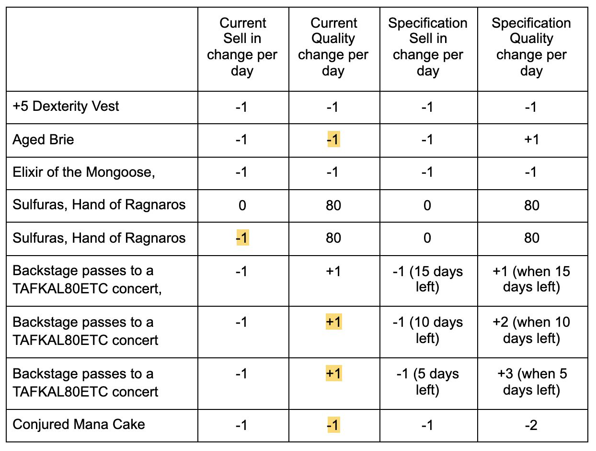

# Project Specification
Hi and welcome to team Gilded Rose. As you know, we are a small inn with a prime location a prominent city ran by a friendly innkeeper named Allison. We also buy and sell only the finest goods. Unfortunately, our goods are constantly degrading in quality as they approach their sell by date. We have a system in place that updates our inventory for us. It was developed by a no-nonsense type named Leeroy, who has moved on to new adventures. Your task is to add the new feature to our system so that we can begin selling a new category of items. First an introduction to our system:

All items have a SellIn value which denotes the number of days we have to sell the item
All items have a Quality value which denotes how valuable the item is
At the end of each day our system lowers both values for every item
Pretty simple, right? Well this is where it gets interesting:

Once the sell by date has passed, Quality degrades twice as fast
The Quality of an item is never negative
“Aged Brie” actually increases in Quality the older it gets
The Quality of an item is never more than 50
“Sulfuras”, being a legendary item, never has to be sold or decreases in Quality
“Backstage passes”, like aged brie, increases in Quality as its SellIn value approaches;
Quality increases by 2 when there are 10 days or less and by 3 when there are 5 days or less but Quality drops to 0 after the concert
We have recently signed a supplier of conjured items. This requires an update to our system:

“Conjured” items degrade in Quality twice as fast as normal items

# Project Set-up

* Clone this repo
* Run `bundle install`
* Run on IRB using `irb -r "./lib/gilded_rose_test"`
* Run `rspec` for unit tests

# Approach

* Check code works as intended.
* Get all current code and code behaviour under test
* Ensure code is readable and follows SRP
add additional feature

As this was a legacy code tech test it was important to understand the code and ensure it was working properly, fully tested before adding any additional features. To do this i created a very hap hazard table to compare the output of texttest_feature.rb to the specification to check the current code is doing as the specification asks.

I have highlighted all the failing changes with the correct change next to it.

This has helped me better understand the behaviour of the code. Which will consequently help to write thorough characterisation tests to ensure the behaviour of the code is tested thoroughly. This will hopefully make refactoring easier.
